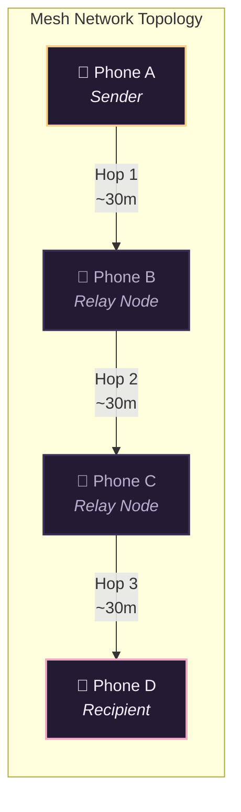

<div align="center">


# Skein
### Decentralized • 100% Offline • End-to-End Encrypted Mesh Messaging

[](https://github.com)
[](https://github.com)
[](https://github.com)
[](LICENSE)

<p align="center">
  <b>Skein</b> is a privacy-first, decentralized messaging application that lets people communicate phone-to-phone via <b>Bluetooth Low Energy (BLE) mesh networking</b> with zero internet, no cell towers, no accounts, and no central servers.
</p>

</div>

---

## 🌟 Key Features

| Feature | Description |
| :--- | :--- |
| ᛒ **100% Offline BLE Mesh** | Direct peer-to-peer communication over Bluetooth Low Energy. Messages hop across nearby phones to extend range beyond line-of-sight. |
| 🔒 **End-to-End Encryption (E2EE)** | Private 1-to-1 Direct Messages are cryptographically encrypted with local keypairs. Intermediate relay nodes cannot read message contents. |
| 📍 **Zero-Tracking Area Chat** | Connect with people in your neighborhood using rough Geohash codes (~1.2 km). Exact GPS coordinates are never stored or broadcast. |
| 🛰️ **Visual Radar Knot Map** | Real-time interactive constellation visualizer showing nearby mesh nodes, distances, and multi-hop routes. |
| 🛡️ **Zero Accounts & Zero Telemetry** | No phone numbers, no email logins, no cloud tracking, and no metadata logging. |
| ⚡ **Battery Optimized** | Low-latency packet relaying designed to conserve battery while maintaining network connectivity. |

---

## 📐 How the Mesh Works



* **Flood-with-TTL Routing**: Each message carries a Time-to-Live (`TTL = 7`). If a device is not the target recipient, it decrements the TTL and rebroadcasts the packet.
* **Loop & Storm Prevention**: A rolling cache of 2,000 remembered packet IDs prevents duplicate relays and infinite routing loops.
* **Automatic Node Discovery**: Devices broadcast passive presence beacons every 8 seconds to maintain active peer tables and hop distances.

---

## 🎨 Design System & Aesthetic

Skein is built on an elegant aubergine, rose, and gold dark theme:

<div align="center">

| Color | Hex Code | Preview | Usage |
| :--- | :---: | :---: | :--- |
| **Ink** | `#15111F` | `⬛` | Deep aubergine dark canvas |
| **Wool** | `#231B33` | `🟪` | Elevated card surfaces and message bubbles |
| **Fiber** | `#3A2E52` | `🟪` | Subtle borders and radar mesh rings |
| **Thread** | `#F2A7C3` | `🌸` | Rose accent, primary buttons, and peer nodes |
| **Knot** | `#F6D186` | `🟨` | Gold center node, highlights, and active badges |
| **Mist** | `#B9AFD0` | `🌫️` | Secondary muted text and labels |
| **Paper** | `#F5EFFA` | `⬜` | Crisp high-contrast primary text |

</div>

---

## 🚀 Getting Started

### Prerequisites
* [Node.js](https://nodejs.org/) (v18 or higher)
* [Expo CLI](https://docs.expo.dev/)
* [EAS CLI](https://docs.expo.dev/build/introduction/) (for cloud & standalone builds)

### Installation

1. **Clone the repository**:
   ```bash
   git clone https://github.com/your-username/skein.git
   cd skein
   ```

2. **Install dependencies**:
   ```bash
   npm install
   ```

3. **Validate TypeScript & Mesh Simulation**:
   ```bash
   npm run typecheck
   npm run test:mesh
   ```

---

## 📱 Building the Standalone APK

Skein includes a dedicated native Bluetooth GATT peripheral & central module (`modules/skein-ble`). To build a direct standalone `.apk` for Android devices:

```bash
# Build standalone preview APK
eas build -p android --profile preview
```

* **Standalone APK**: Installs directly on physical Android phones.
* **No Dev Server Required**: Bundles all JavaScript and assets inside the APK.

---

## 📂 Project Structure

```text
skein/
├── assets/                    # Master icons, splash screens, and banner graphics
│   ├── adaptive-icon.png      # Android safe-zone adaptive icon
│   ├── banner.png             # Promotional banner
│   ├── icon.png               # 1024x1024 master icon
│   └── splash.png             # Native splash screen
├── modules/
│   └── skein-ble/             # Native Android Kotlin BLE module
│       └── android/src/main/java/com/skein/mesh/ble/SkeinBleModule.kt
├── src/
│   ├── components/
│   │   ├── ChannelBar.tsx     # Channel & DM tab selector
│   │   ├── Composer.tsx       # Message input field
│   │   ├── KnotMap.tsx        # Animated SVG radar mesh map
│   │   ├── MessageList.tsx    # Chat bubbles with E2EE badges & hop stitches
│   │   └── SkeinLogo.tsx      # Vector animated brand emblem
│   ├── location/
│   │   ├── geohash.ts         # Geohash encoding & decoding utilities
│   │   └── useArea.ts         # Ephemeral neighborhood location hook
│   ├── mesh/
│   │   ├── BleTransport.ts    # Native BLE transport bridge
│   │   ├── MeshEngine.ts      # Mesh flooding & packet routing engine
│   │   ├── crypto.ts          # E2EE keypairs & encryption/decryption
│   │   ├── ids.ts             # Random ID generator
│   │   └── types.ts           # Protocol data models
│   ├── screens/
│   │   ├── Home.tsx           # Main chat & mesh interface
│   │   ├── Onboarding.tsx     # Privacy & permissions onboarding
│   │   └── SettingsModal.tsx  # Diagnostic terminal & feature overview
│   ├── config.ts              # Network constants (TTL, beacon intervals, UUIDs)
│   ├── permissions.ts         # Runtime permission checkers & requesters
│   ├── storage.ts             # Local state & key persistence
│   └── theme.ts               # Color palette & font definitions
├── App.tsx                    # Root application entry & splash handler
├── app.json                   # Expo configuration & plugins
└── eas.json                   # EAS build configuration
```

---

## 📄 License

This project is licensed under the [MIT License](LICENSE).

<div align="center">
  <sub>Built with ❤️ for decentralized, censorship-resistant communication.</sub>
</div>
